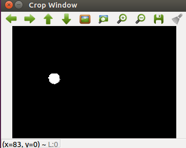
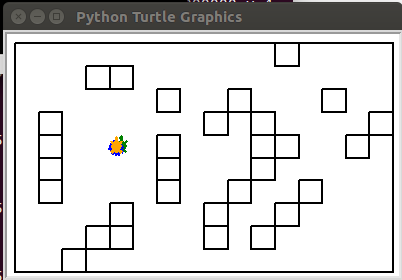

# Camera Sensing and Particle Filter
This lab interfaces the UR3 robotic arm with a camera that allows the user to control the movement of the arm with the arrow keys on a grid. The particle filter is used with the camera to estimate the position of an orange dot attached to the end effector of the arm, and then to display this estimate on the computer. The main packages used to accomplish this are OpenCV and ROS in Python.

## Edited Files
The files containing my code are:    

Calibrate camera to detect orange dot:  
[lab3_func.py](https://github.com/monk200/Robotics_with_UR3_and_Gazebo/blob/main/Camera_Sensing_and_Particle_FIlter/lab3_func.py): lines 14-35, 51-57, 71-106  
  
Calculate and apply rotations and transformations between world frame and image frame:  
[lab3_image_tf_exec.py](https://github.com/monk200/Robotics_with_UR3_and_Gazebo/blob/main/Camera_Sensing_and_Particle_FIlter/lab3_image_tf_exec.py): lines 75-104  
[lab3_image_exec.py](https://github.com/monk200/Robotics_with_UR3_and_Gazebo/blob/main/Camera_Sensing_and_Particle_FIlter/lab3_image_exec.py): lines 70-107  
  
Create the particleFilter class by completeing the constructor and making the functions Sample_Motion_Model, Measurement_Model, and calcPosition:  
[lab3_move_exec.py](https://github.com/monk200/Robotics_with_UR3_and_Gazebo/blob/main/Camera_Sensing_and_Particle_FIlter/lab3_move_exec.py): lines 646-747  
[Particle Filter.py](https://github.com/monk200/Robotics_with_UR3_and_Gazebo/blob/main/Camera_Sensing_and_Particle_FIlter/Particle%20Filter.py): lines 466-564

## Process
#### [lab3_func.py](https://github.com/monk200/Robotics_with_UR3_and_Gazebo/blob/main/Camera_Sensing_and_Particle_FIlter/lab3_func.py)
The first step taken was to be able to recognize the orange dot in the camera. This involved finding the appropriate hue, saturation, and value ranges for the dot because the camera reads images using the HSV color space. By measuring the HSV values of the orange dot at various locations on the counter, a range that withstands shadows and bright spots can be determined. Some adjustments to the cropping of the camera's view can also be made at this time. OpenCV's simpleBlobDetector library can be used to filter by circularity and by the range of HSV values to find the orange dot. simpleBlobDetector's circularity is definted as (4*pi*Area)/(perimeter^2), which makes a circle have a circularity of 1 and a square have a circularity of 0.785. The inital range given to circularity was 0.5 to 1.2, which should technically even find an orange square but since the environement was controlled enough and the HSV range was precise enough, this was not an issue. Next, the keypoint coordinates of each blob needed to be saved and formatted in a way to draw red circles around the orange dot in the normal camera window. A delay was encountered here because it took a decent amount of time to figure out how to format the keypoints list so that it interfaces correctly with the rest of the code.
#### [lab3_image_tf_exec.py](https://github.com/monk200/Robotics_with_UR3_and_Gazebo/blob/main/Camera_Sensing_and_Particle_FIlter/lab3_image_tf_exec.py) and [lab3_image_exec.py](https://github.com/monk200/Robotics_with_UR3_and_Gazebo/blob/main/Camera_Sensing_and_Particle_FIlter/lab3_image_exec.py)
Now, some calculations needed to be done to perform a perspective transform to align the world and camera frames. Beta was calculated knowing that the distance between two points in pixels on the camera is equal to beta multiplied by the distance between those two points in the real world. Tx and Ty are the origin of the world frame expressed in the camera frame and were set by just looking at how offset the origin of the camera was from the corner of the grid on the table, and then converting them using beta. Theta was estimated by horizontally aligning two orange dots in real life and checking their heigh difference in pixels on the computer screen. With the height difference and the distance between the two dots, the angle could be calculated using the inverse tangent. To finish these calculations, the perspective transform relationship below was used to apply the needed rotations and translations to get the world frame coordinates in terms of image coordinates, r and c.  
  
intrinsic: r = beta * xc + Or ; c = beta * yc + Oc  
extrinsic: xc = cos(theta) * xw + (-sin(theta) * yw) + Tx ; yc = sin(theta) * xw + cos(theta) * yw + Ty  
#### [lab3_move_exec.py](https://github.com/monk200/Robotics_with_UR3_and_Gazebo/blob/main/Camera_Sensing_and_Particle_FIlter/lab3_move_exec.py) and [Particle Filter.py](https://github.com/monk200/Robotics_with_UR3_and_Gazebo/blob/main/Camera_Sensing_and_Particle_FIlter/Particle%20Filter.py)
Following instructions in comments in the code, a particle filter was implemented and used to create a grid pattern with a controllable green turtle that follows the movement of the robotic arm and a yellow turtle indicating where the particle filter believes the green turtle is based on the camera's recognition of the orange dot attached to the end effector of the UR3 arm. Particle Filter.py can be run as its own standalone file and will pop up a small window with a turtle that can be (slowly) controlled with the arrow keys. In lines 566-604, you are able to comment out part of it to determine if the resamling is universal (randomly chooses particle that will get resampled among all particles available) or roulette (prioritzes resampling particles with higher weights but is still fairly random). Through practice, it can be seen that roulette sampling performs better and the results can be seen in the videos 'particle filter og roulette' and 'particle filter og universal'.

## Output
The cropped window below shows one orange blob being recognized by the camera.  
  
  
The image below shows the computer output showing the green, operator-controlled turtle overliad by the yellow, computer controlled turtle estimate.  
  

The videos [particle filter og roulette.mp4](https://github.com/monk200/Robotics_with_UR3_and_Gazebo/blob/main/Camera_Sensing_and_Particle_FIlter/particle%20filter%20og%20roulette.mp4) and [particle filter og universal.mp4](https://github.com/monk200/Robotics_with_UR3_and_Gazebo/blob/main/Camera_Sensing_and_Particle_FIlter/particle%20filter%20og%20universal.mp4) can be downloaded to watch the performance of the particle filter with their respective sampling type.
